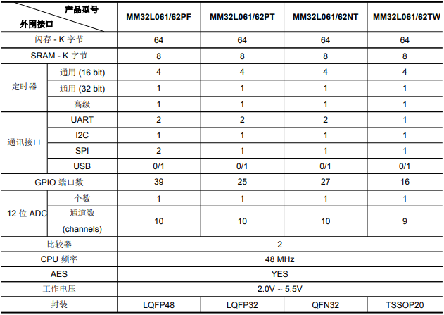

# [MM32L062](https://github.com/SoCXin/MM32L062)

#### [Vendor](https://github.com/SoCXin/Vendor)：[MindMotion](http://www.mm32.com.cn/)
#### [Core](https://github.com/SoCXin/Cortex)：[Cortex M0](https://github.com/SoCXin/CM0)
#### [Level](https://github.com/SoCXin/Level)：48MHz

## [描述](https://github.com/SoCXin/MM32L062/wiki)

[MM32L062](https://github.com/SoCXin/MM32L062)具有丰富的功能和通信接口，包括AES,USB

### 关键特性：

AES 硬件加速器使用 AES 算法可以对数据进行加密和解密。由 FIPS 定义 (FIPS PUB 197， 2001 November 26) 的高级加密标准 (AES) 加速器使用 128bit 或 192bit 或 256bit 密钥加密和解密 128bit 的数据块。默认情况下，电子密码本 (ECB) 被选中。密码分组链接 (CBC)、计算器模式 (CTR)、密文反馈模式 (CFB) 和输出反馈模式 (OFB) 也被该硬件支持。

AES支持输入和输出数据的DMA传输(需要2个DMA通道，共有5个DMA通道)。内部256bit寄存器存储加密和解密密钥 (8x32 bit 寄存器组)，处理 128 bit 数据块。

### [资源收录](https://github.com/SoCXin/MM32L062)

* [文档](docs/)
* [资源](src/)

### [选型建议](https://github.com/SoCXin)

设备具备AES硬件单元，便于物联网数据安全实现，丰富的接口保证了单芯片功能和效率

* [MM32L051](https://github.com/SoCXin/MM32L051)偏向低成本采集控制设备,串口通信
* [MM32L062](https://github.com/SoCXin/MM32L062)偏向USB等高效率配置设备
* [MM32L073](https://github.com/SoCXin/MM32L073)偏向CAN控制网关类产品

###  [SoC芯平台](http://www.SoC.Xin)
